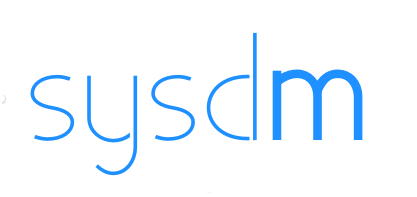

  

# sysdm

Scripts as a service. Builds on systemd.

It gives you the best from screen, cronjobs, supervisord, systemctl and journalctl.

### Installation

    pip install sysdm

### Demo

  

### Usage examples

    sysdm create myfile.py               # creates, starts and enables a new service file
    sysdm create myfile.py --timer daily # the above + schedules it to run daily
    sysdm ls                             # see the known services created by sysdm
    sysdm delete                         # see the known services and select to delete
    sysdm run                            # run the app in the foreground (e.g for debugging)

### Features

Creating and viewing have just helped you with:

- Generate a systemd unit file on the fly
- Uses current info to determine, and pin, working directory and virtualenv paths in your unit.
- Script will start running, and also boot on start
- Script will restart on error
- Script can also be started on a schedule (e.g. `--timer daily`), using systemd timers
- Changes to files in the directory of the same extension will cause a reload (e.g. `.py`)
- Provides a UI for inspecting the logs of your script and start, stop etc
- Like with screen, you can leave and it will keep on running.
- Multiple people can look at it, too, when sharing a server.
- Provides flags to change settings
- UI is aware of the window-size
